# NXP Application Code Hub
[](https://www.nxp.com)

## P3T1755: I3C temperature sensor demo

- This example code demonstrates MIPI I3C bus operation with P3T1755 temperature sensor and MCX microcontroller.  
- MIPI I3C bus is a serial bus that performs high datarate data transfer with two wire signals. 
The protocol is similar to I²C but has several extended features like Dynamic Address Assignment (DAA), In-band interrupt (IBI), etc.  
  - This code shows those features and signal characteristics.  
  - The MIPI I3C bus is introduced in an NXP document: [SYSTEM MANAGEMENT I²C, I3C AND SPI SELECTOR GUIDE](https://www.nxp.com/docs/en/product-selector-guide/I2CSELECTORBROC.pdf). 
- As a target device of I3C, the P3T1755 is used. 
- The P3T1755 is a temperature-to-digital converter from -40 °C to +125 °C range. It uses an on-chip band gap temperature sensor and A-to-D conversion technique with
an overtemperature detection. The device contains a number of configuration and data registers to store the device settings, such as device operation mode, and a temperature register (Temp) to store the digital temp reading that can be communicated by a controller via the 2-wire serial I3C (up to 12.5 MHz) and I2C (up to 3.4 MHz) interface. 
For the details of the P3T1755, please refer to its [datasheet](https://www.nxp.com/docs/en/data-sheet/P3T1755.pdf)
- An MCU abstraction library: `r01lib` is used. It's a library to write demo code easily by presenting operations of serial buses and GPIO pins with simple APIs. Those APIs are inspired by Arm Mbed SDK. This library is distributed as a part of this example code.
  - The `r01lib` is included in library projects of `_r01lib_frdm_mcx*`. 
  - All source code is available in `_r01lib_frdm_mcx*/source/` folder.
  - Documents are available in `_r01lib_frdm_mcx*/r01lib_docs/` folder.
  - `r01device` is also included in this library. The `r01device` is a class driver collection to present peripheral devices with simple API. 

[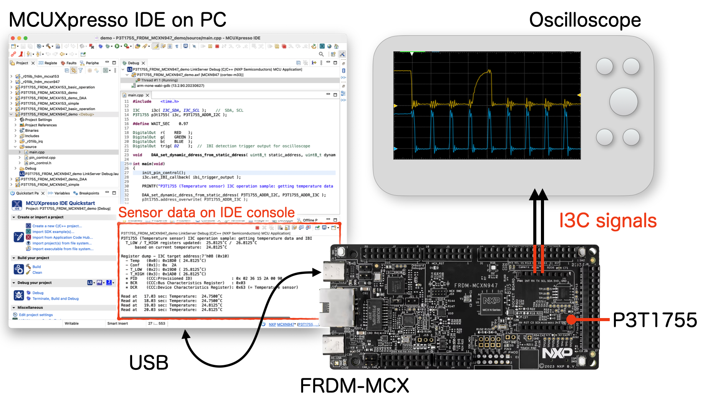](block.png)

#### Boards: FRDM-MCXN947, FRDM-MCXA153
#### Categories: Sensor
#### Peripherals: I3C
#### Toolchains: MCUXpresso IDE

## Table of Contents
1. [Software](#step1)
2. [Hardware](#step2)
3. [Setup](#step3)
4. [Results](#step4)
6. [FAQs](#step5) 
7. [Support](#step6)
8. [Release Notes](#step7)


## 1. Software<a name="step1"></a>
- One of two from below, depends on your hardware
  - MCUXpresso [SDK v2.14.0 or later](https://mcuxpresso.nxp.com/en/select) for FRDM-MCXN947
  - MCUXpresso [SDK v2.14.2 or later](https://mcuxpresso.nxp.com/en/select) for FRDM-MCXA153 
- [MCUXpresso IDE 11.9.1 or later](https://www.nxp.com/design/design-center/software/development-software/mcuxpresso-software-and-tools-/mcuxpresso-integrated-development-environment-ide:MCUXpresso-IDE) (operation checked with 11.9.1 and 11.10.0)

## 2. Hardware<a name="step2"></a>
- One of two from below
  - [FRDM-MCXN947 MCU board](https://www.nxp.com/design/design-center/development-boards/general-purpose-mcus/frdm-development-board-for-mcx-n94-n54-mcus:FRDM-MCXN947)
  - [FRDM-MCXA153 MCU board](https://www.nxp.com/design/design-center/development-boards/general-purpose-mcus/frdm-development-board-for-mcx-a14x-a15x-mcus:FRDM-MCXA153)
- Personal Computer
- Type-C USB cable
- Oscilloscope
- (option) [P3T1755DP Arduino® Shield Evaluation Board](https://www.nxp.com/design/design-center/development-boards/analog-toolbox/arduino-shields-solutions/p3t1755dp-arduino-shield-evaluation-board:P3T1755DP-ARD)

## 3. Setup<a name="step3"></a>

### 3.1 - Step 0: Conect hardware
- Connect an FRDM-MCXN947 or an FRDM-MCXA153 board to PC via USB cable
- (option) connect I3C signals to an oscilloscope
  - FRDM-MCXN947:SDA=J5-3, SCL=J5-4
  - FRDM-MCXA153:SDA=J20, SCL=J21)

### 3.2 - Step 1: Download and Install required Software(s)
- Download and Install [MCUXpresso IDE 11.9.1 or later](https://www.nxp.com/design/design-center/software/development-software/mcuxpresso-software-and-tools-/mcuxpresso-integrated-development-environment-ide:MCUXpresso-IDE)
- Download and Install one of following
  - MCXUpresso [SDK v2.14.0 or later](https://mcuxpresso.nxp.com/en/select) for FRDM-MCXN947
  - MCXUpresso [SDK v2.14.2 or later](https://mcuxpresso.nxp.com/en/select) for FRDM-MCXA153

### 3.3 - Step 2: Download the code from APP-CODE-HUB and import
- Launch MCUXpresso IDE and make a new workspace
- Download the zip file and store it on user's PC
- Go to "Quickstart Panel" and click on "Import Project(s) from file system"   
[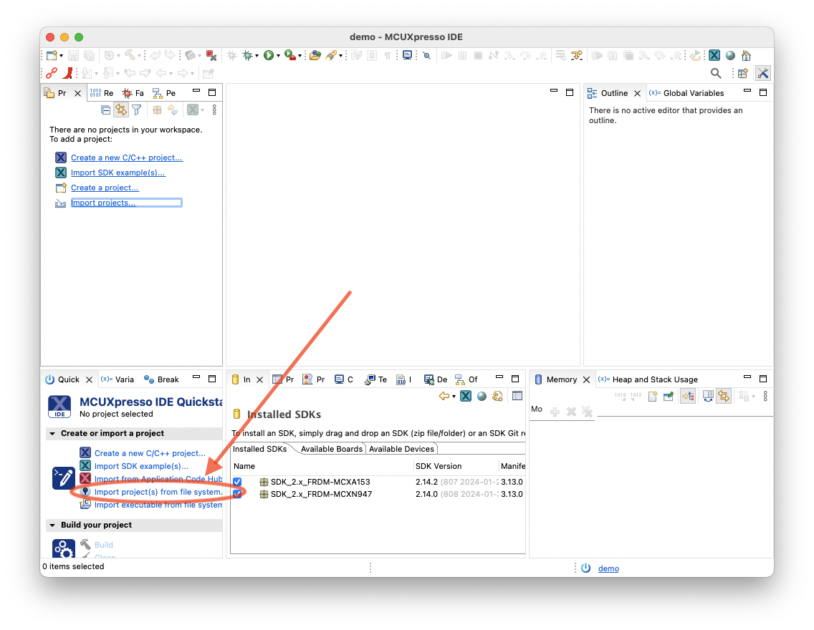](ide0.png)   
[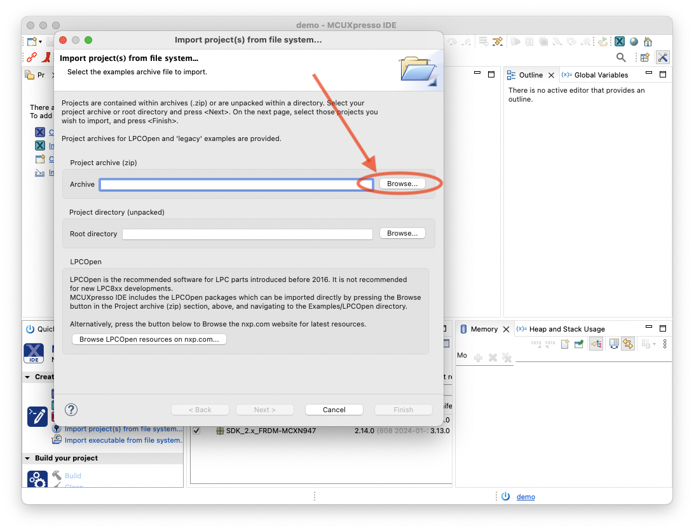](ide1.png)   
[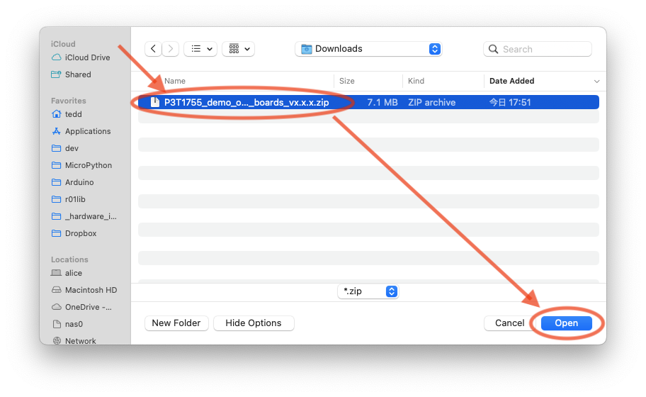](ide2.png)   
[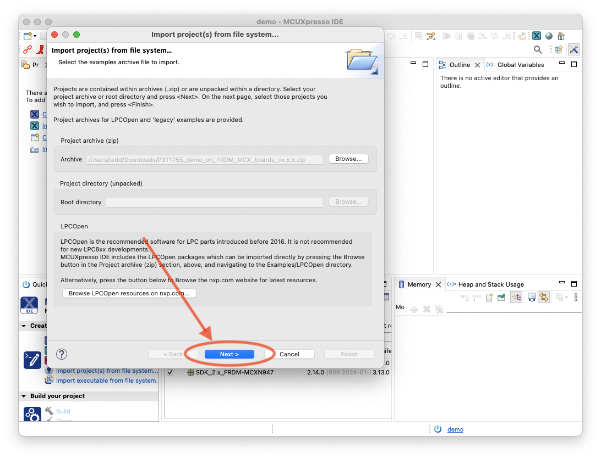](ide3.png)   
[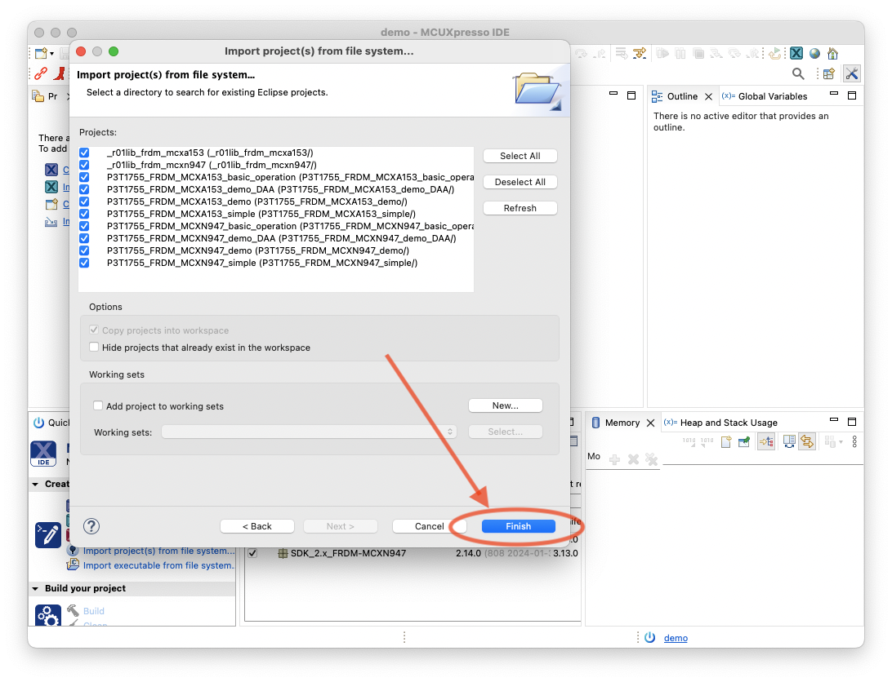](ide4.png)   
[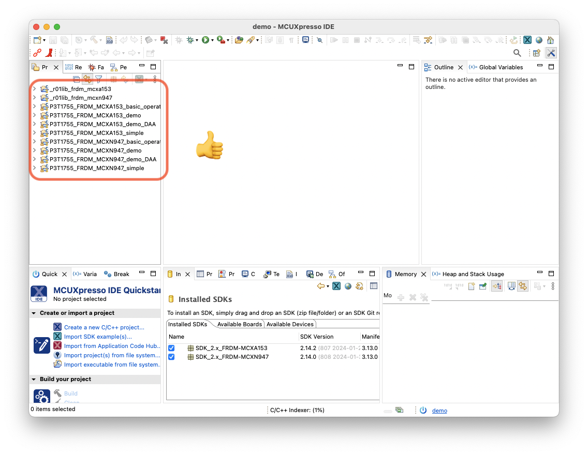](ide5.png)   

**NOTE**: If you are using MCUXpresso SDK `v2.14.x`, the IDE will show an error message "the SDK v2.16 is not found and it will use v2.14.x". This is an expected message and you can use the code by just pressing the "OK" button. This message will appear for each project. Press OK for each time.     
  [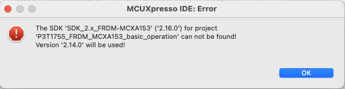](using_SDK_v2.14.x.png)   

**NOTE** : Even if you use MCUXpresso SDK `v2.16.0`, you may get a dialog box for selecting SDK. In this case, user may not be required to select the SDK version. Pressing the "OK" button to close the dialog boxes which will be shown for all projects.   
  [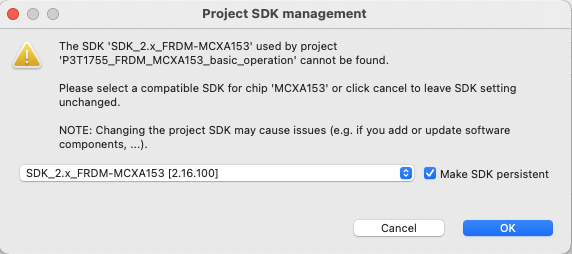](using_SDK_v2.16.0.png)  

### 3.4 - Step 3: Build and run
- Select `P3T1755_FRDM_MCXN947_demo` or `P3T1755_FRDM_MCXA153_demo` project in the "Project Explorer" panel in left-top pane
- Click the "Debug" icon in the "Quickstart Panel" or the "Start debugging project" icon (blue bug icon) in icon-toolbar
- The IDE will find the MCU board and resume the program at "main()" function started
- Press the "Resume" button to continue from there   

[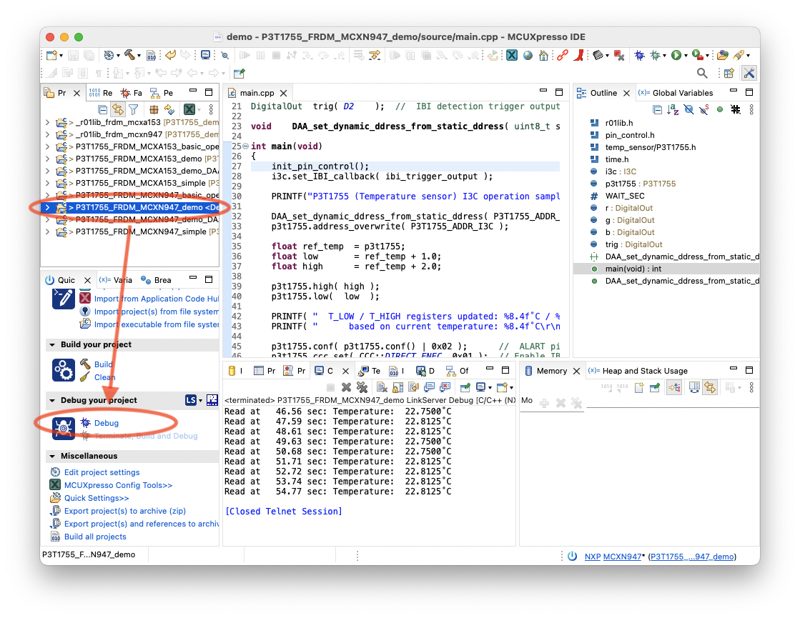](run0.png)   
[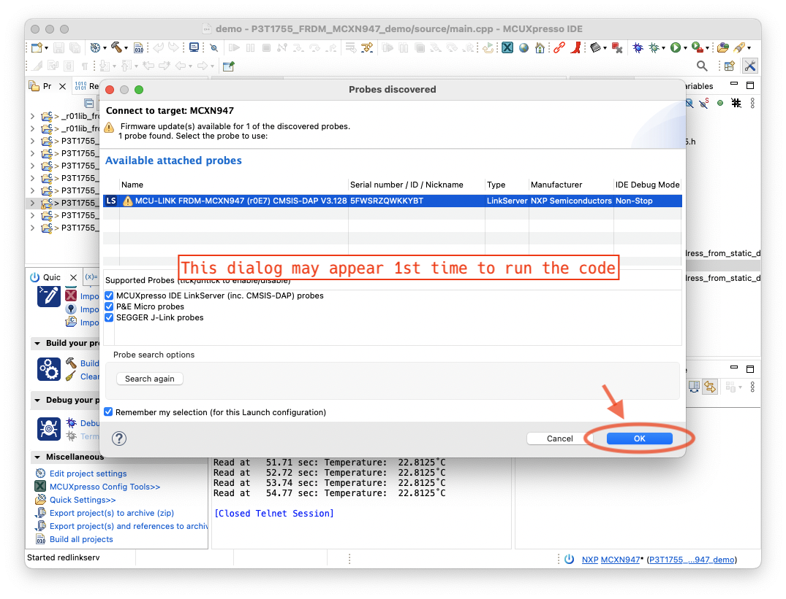](run1.png)   
[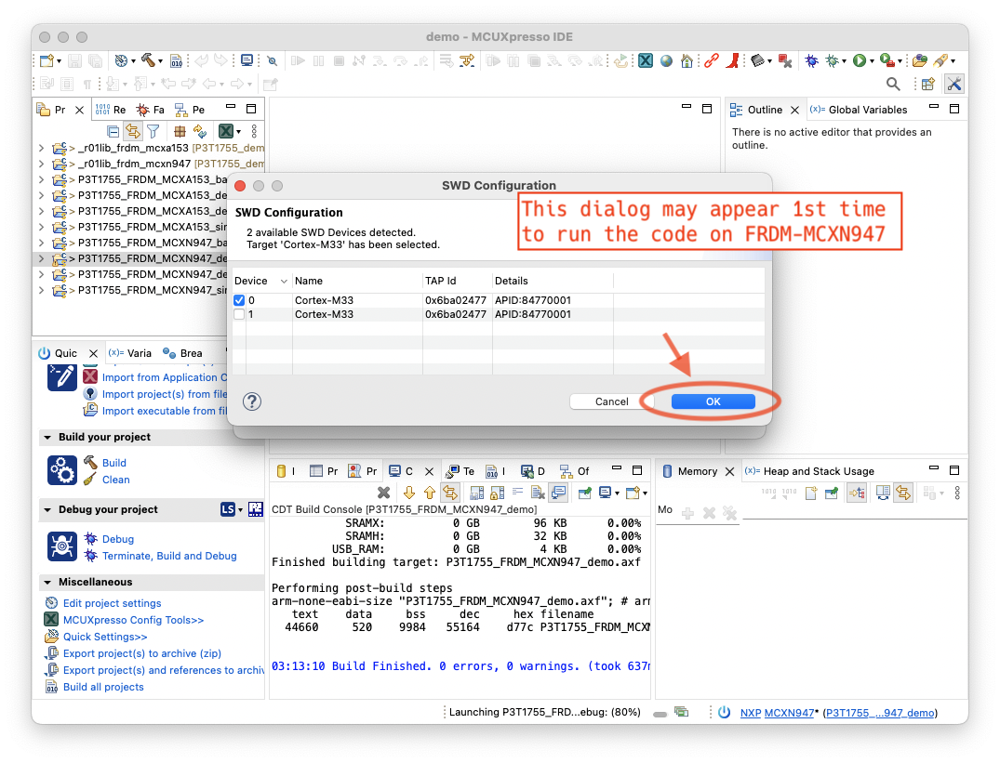](run2.png)   
[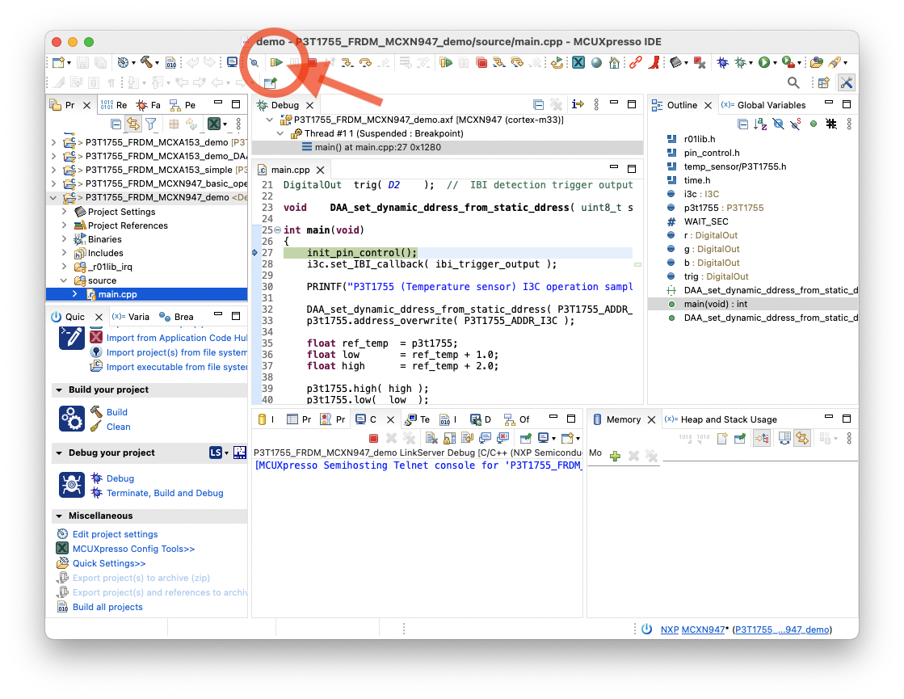](run3.png)   
[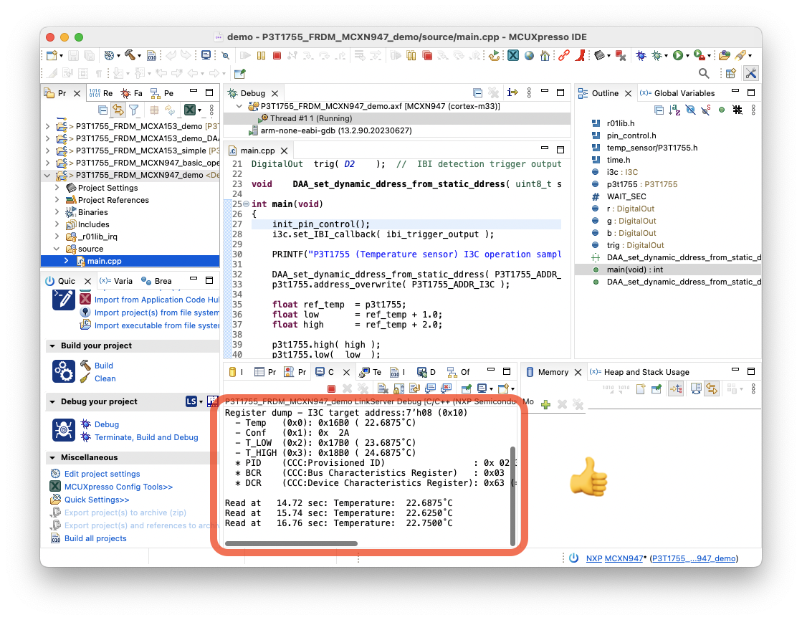](run4.png)   


## 4. Results<a name="step4"></a>
- The temperature values are shown on the terminal panel (middle-bottom pane) in MCUXpresso IDE
- LED blinking color is changed by temperature    

    [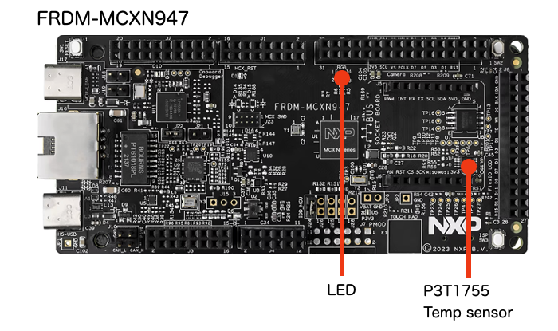](sensor_on_n.png.png)    
    [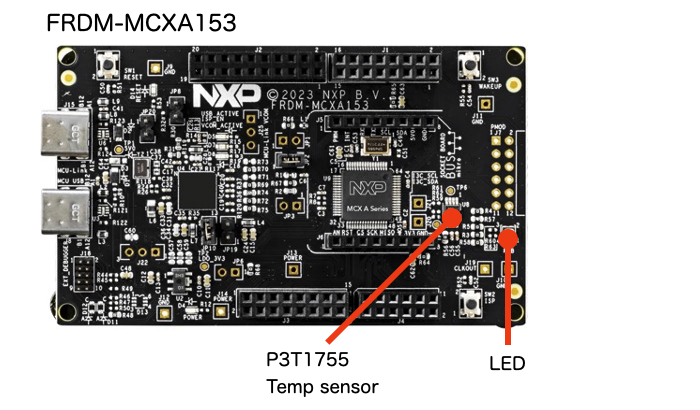](sensor_on_a.png.png)    

- Touch on P3T1755 to heat up by finger temperature or use a hair-dryer, a cooling-splay to find the value changes

    [](sensor_on_n.png.png)    
    [](sensor_on_a.png.png)    
    
- In IBI enabled example, the IBI event will be shown in the terminal panel. The default setting to trigger the IBI is 2 degree-C higher temperature than the program started (T_HIGH register set to T_program_start + 2 degC). IBI will be triggered again when the temperature is down to T_start + 1degC. 
- Probe on I3C signals and confirm the waveform. In IBI enabled example, the D2 pin outputs a trigger signal (falling edge) at the IBI event for an oscilloscope. 

    [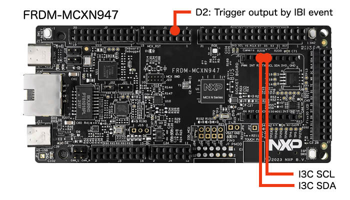](pins_on_n.png.png)    
    [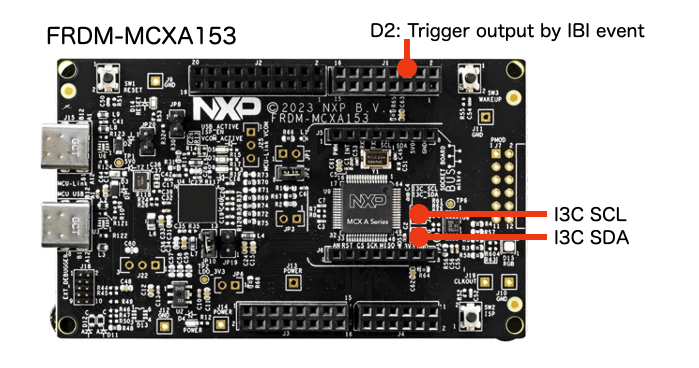](pins_on_a.png.png)    


## 5. Projects (contents of this repo)
This sample contains projects to demo the I3C in several ways.    
The next list shows the projects and those features.   

Project name|Target board|Purpose|I3C operation|LED operation|IBI|DAA|
---|---|---|---|---|---|---
P3T1755_FRDM_MCXA153_demo             |FRDM-MCXA153 |I3C demo with LED blink color change         |✅|✅|✅|From static address
P3T1755_FRDM_MCXA153_demo_DAA         |FRDM-MCXA153 |I3C demo with LED blink color change         |✅|✅|✅|Dynamic
P3T1755_FRDM_MCXA153_simple           |FRDM-MCXA153 |To show P3T1755 device class basic operation |✅|  |  |From static address
P3T1755_FRDM_MCXA153_basic_operation  |FRDM-MCXA153 |To show I3C class basic operation            |✅|  |  |From static address
P3T1755_FRDM_MCXN947_demo             |FRDM-MCXN947 |I3C demo with LED blink color change         |✅|✅|✅|From static address
P3T1755_FRDM_MCXN947_demo_DAA         |FRDM-MCXN947 |I3C demo with LED blink color change         |✅|✅|✅|Dynamic
P3T1755_FRDM_MCXN947_simple           |FRDM-MCXN947 |To show P3T1755 device class basic operation |✅|  |  |From static address
P3T1755_FRDM_MCXN947_basic_operation  |FRDM-MCXN947 |To show I3C class basic operation            |✅|  |  |From static address
_r01lib_frdm_mcxa153                  |FRDM-MCXA153 |Library to be linked from application projects|  |  |  |  
_r01lib_frdm_mcxn947                  |FRDM-MCXN947 |Library to be linked from application projects|  |  |  |  

> **Note** The `_r01lib_*`" projects are libraries. Those codes cannot be executed alone

## 6. FAQ<a name="step5"></a>
- How to operate P3T1755DP-ARD with FRDM-MCX**N947**?
  - For FRDM-MCXN947, the P3T1755DP-ARD is needed to be connected with 4 wires. With this connection, 2 P3T1755 temp sensors are on I3C bus. The Arduino-shield board's P3T1755 has I²C static address as `0x4C`.  
      [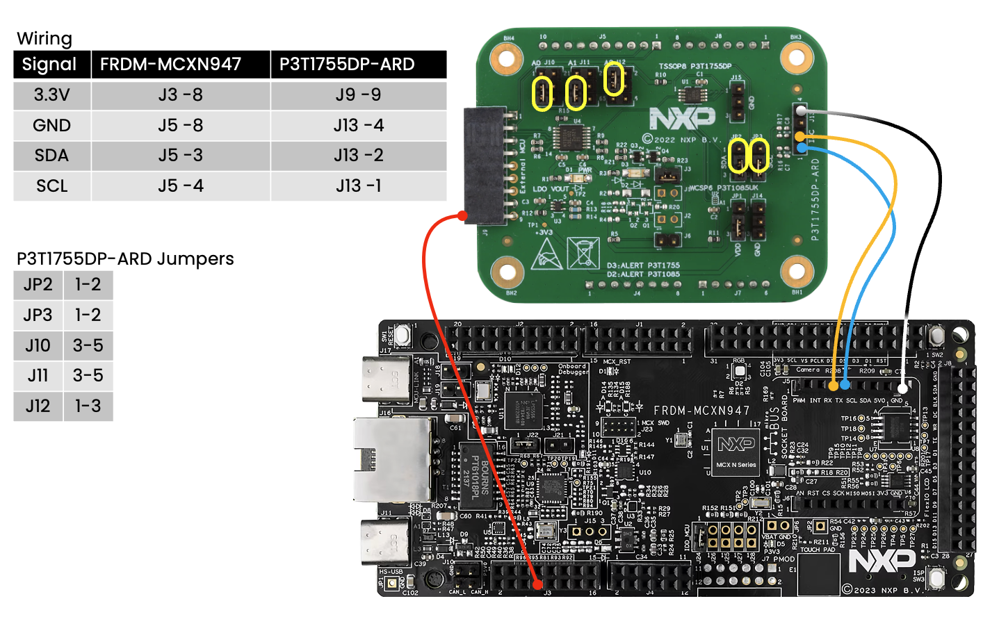](wiring-N-ARD.png)   
  - Modify code as next sample to give I3C dynamic address to the P3T1755 on Arduino-shield board. For instance, in `P3T1755_FRDM_MCXN947_demo/source/main.cpp`, it can be done as the next sample. 
    ```cpp
    #include  "r01lib.h"
    #include  "pin_control.h"
    #include  "temp_sensor/P3T1755.h"
    #include  <time.h>
    
    #undef  P3T1755_ADDR_I2C          //  <-- ADD THIS LINE
    #define P3T1755_ADDR_I2C	0x4C  //  <-- ADD THIS LINE

    I3C     i3c( I3C_SDA, I3C_SCL );
    P3T1755 p3t1755( i3c, P3T1755_ADDR_I2C );
    ```
- How to operate P3T1755DP-ARD with FRDM-MCX**A153**?
  - For FRDM-MCXN153, the P3T1755DP-ARD can be just put on the Arduino-shield socket. 
      [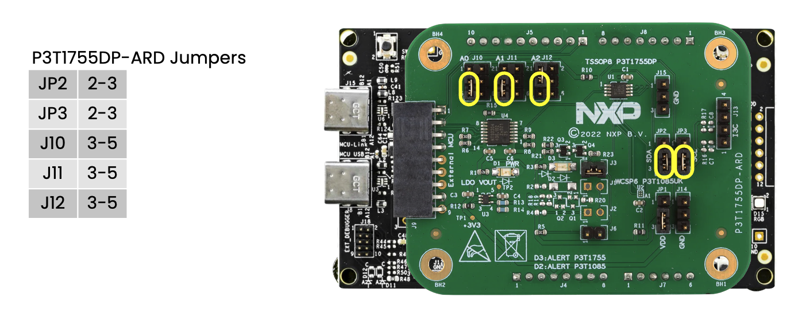](wiring-A-ARD.png)   
  - Modify code as next sample to re-route the I3C on D18 and D19 (J2's 18 a d 20 pins on FRDM-MCXA513, J5's 9 and 10 pins on P3T1755DP-ARD). With this setting, the I3C bus is operated through a voltage-level-translator:NTS0304. The NTS0304 will accelerate rise time on open-drain signal but I3C can be operated.  
    ```cpp
    //I3C   i3c( I3C_SDA, I3C_SCL );  // REPLACE THIS LINE TO NEXT
    I3C     i3c( I2C_SDA, I2C_SCL );  // USE I2C_SDA and USE I2C_SCL ("3" → "2")
    ```
- Importing projects into Visual Studio Code (VSC)  
Use MCUXpresso for VS Code 1.10 or later to import projects correctly.

## 7. Support<a name="step5"></a>
- Reach out to NXP Sensors Community page for more support - [NXP Community](https://community.nxp.com)
- Learn more about P3T1755: I3C, I2C-bus interface, 0.5 °C accuracy, digital temperature sensor, refer to - [P3T1755 Product summary page](https://www.nxp.com/products/sensors/i3c-ic-digital-temp-sensors/i3c-ic-bus-0-5-c-accurate-digital-temperature-sensor:P3T1755DP)
- "SYSTEM MANAGEMENT I²C, I3C AND SPI SELECTOR GUIDE" including introduction of I3C bus, refer to - [Sensors Development Ecosystem](https://www.nxp.com/docs/en/product-selector-guide/I2CSELECTORBROC.pdf)

#### Project Metadata
<!----- Boards ----->
[](https://github.com/search?q=org%3Anxp-appcodehub+FRDM-MCXN947+in%3Areadme&type=Repositories) [](https://github.com/search?q=org%3Anxp-appcodehub+FRDM-MCXA153+in%3Areadme&type=Repositories)

<!----- Categories ----->
[](https://github.com/search?q=org%3Anxp-appcodehub+sensor+in%3Areadme&type=Repositories) [](https://github.com/search?q=org%3Anxp-appcodehub+low_power+in%3Areadme&type=Repositories)

<!----- Peripherals ----->
[](https://github.com/search?q=org%3Anxp-appcodehub+i3c+in%3Areadme&type=Repositories) [](https://github.com/search?q=org%3Anxp-appcodehub+sensor+in%3Areadme&type=Repositories)

<!----- Toolchains ----->
[](https://github.com/search?q=org%3Anxp-appcodehub+mcux+in%3Areadme&type=Repositories)

Questions regarding the content/correctness of this example can be entered as Issues within this GitHub repository.

>**Warning**: For more general technical questions regarding NXP Microcontrollers and the difference in expected functionality, enter your questions on the [NXP Community Forum](https://community.nxp.com/)

[](https://www.youtube.com/@NXP_Semiconductors)
[](https://www.linkedin.com/company/nxp-semiconductors)
[](https://www.facebook.com/nxpsemi/)
[](https://twitter.com/NXP)

## 8. Release Notes<a name="step7"></a>
| Version | Description / Update                           | Date                        |
|:-------:|------------------------------------------------|----------------------------:|
| 1.0     | Initial release on Application Code Hub        | Nov 10<sup>th</sup> 2024 |
